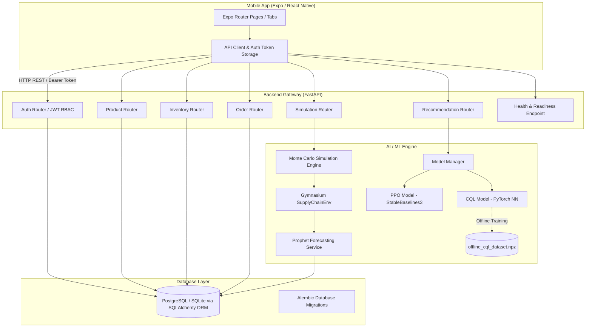

# SupplySense

**AI-Powered Supply Chain Optimization SaaS**

---

## 📋 Overview

**SupplySense** is an enterprise-grade supply chain optimization platform designed to solve one of the most critical challenges in business logistics: balancing inventory stockouts against overstocking costs.

- **The Problem**: Inventory managers frequently face unpredictable customer demand, variable supplier lead times, and fulfillment delays. Ordering too little leads to missed sales, customer dissatisfaction, and lost revenue. Ordering too much binds capital in holding costs, increases warehouse overhead, and risks inventory obsolescence.
- **The Solution**: SupplySense unifies real-time inventory management, time-series demand forecasting with Meta Prophet, discrete supply chain simulation with OpenAI Gymnasium, and Reinforcement Learning (PPO and CQL) to recommend reordering actions (Hold, Order, or Expedite).
- **Human-in-the-Loop**: Rather than forcing automated execution, SupplySense surfaces actionable AI recommendations with financial cost projections and confidence metrics, empowering supply chain managers to approve, reject, or adjust orders.

---

## ✨ Key Features

- **Multi-Tenant SaaS & Role-Based Access Control (RBAC)**: Secure multi-organization architecture with JWT authentication, access/refresh token rotation, Argon2 password hashing, and granular user roles (`Admin`, `Manager`, `Viewer`).
- **Product & Inventory Management**: Centralized product catalog with real-time stock tracking, unit purchasing costs, listing prices, safety stock thresholds, and low-stock alerts.
- **Supplier Network Management**: Comprehensive supplier profiles tracking lead times (in days), historical reliability scores (0–1.0), and contact metadata.
- **Prophet Demand Forecasting**: Automated time-series demand forecasting using Meta Prophet, producing future demand estimates alongside upper and lower confidence intervals over configurable horizons (7, 14, or 30 days).
- **Supply Chain Simulation Engine**: A stochastic what-if simulation engine that models inventory dynamics, lead time delays, holding costs ($0.02 \times \text{cost}$), shortage penalties ($1.5 \times \text{price}$), and expedite fees ($\$50$) over custom day horizons without mutating production data.
- **AI/RL Reorder Recommendations**: Intelligent decision support powered by Proximal Policy Optimization (PPO) and Conservative Q-Learning (CQL) to recommend optimal discrete actions (`0: NOOP`, `1: Regular Order`, `2: Expedite Order`).
- **Purchase Order Lifecycle**: End-to-end purchase order creation, tracking, status progression (`Pending`, `Placed`, `Shipped`, `Delivered`, `Cancelled`), and automatic inventory replenishment upon delivery.
- **Analytics & Executive Dashboard**: Financial and operational dashboards detailing total inventory valuation, stockout risk distribution, order status breakdown, profit/cost impact tracking, and service levels.
- **Audit Activity Logging**: Immutable multi-tenant audit logs capturing user actions, order state transitions, and AI decision approvals for operational transparency.

---

## 🔄 How It Works

```
┌────────────────────────────────┐      ┌───────────────────────────────┐
│ 1. Data Ingestion & State      │      │ 2. Prophet Demand Forecasting │
│    - Current Inventory Stock   │ ───► │    - Historical Sales Analysis│
│    - Supplier Lead & Reliability│      │    - Horizon Forecast + CI    │
└────────────────────────────────┘      └───────────────────────────────┘
                                                        │
                                                        ▼
┌────────────────────────────────┐      ┌───────────────────────────────┐
│ 4. Human-in-the-Loop Approval  │      │ 3. RL Policy Inference        │
│    - Review Cost/Profit Impact │ ◄─── │    - State Observation Vector │
│    - Approve / Reject Action   │      │    - PPO / CQL Action Engine  │
└────────────────────────────────┘      └───────────────────────────────┘
                │
                ▼
┌────────────────────────────────┐
│ 5. Order Execution & Audit Log │
│    - Purchase Order Lifecycle  │
│    - Auto-Inventory Replenish  │
└────────────────────────────────┘
```

1. **State Tracking**: Real-time monitoring of current stock levels, pipeline orders in transit, supplier lead times, and product cost parameters.
2. **Demand Forecasting**: Historical sales logs are fed into Prophet models to predict daily customer demand trends and forecast bounds.
3. **Simulation & RL Evaluation**: The 9-dimensional state vector is processed by trained RL agents (PPO / CQL) within a Gymnasium-compliant environment to evaluate potential reorder decisions against holding and stockout trade-offs.
4. **AI Recommendation**: The system surfaces an actionable reorder recommendation (`NOOP`, `ORDER`, or `EXPEDITE`) accompanied by confidence scores and estimated financial impact.
5. **Human Review & Execution**: Supply chain managers review and approve recommendations, triggering purchase order placement, audit logging, and automated stock replenishment upon shipment delivery.

---

## 🤖 AI / ML Architecture & Concepts

### Core ML Components

- **Prophet Demand Forecasting (`forecasting_service.py`)**: Time-series model developed by Meta that decomposes demand trends into baseline, seasonal, and holiday components, generating expected demand $d_t$ and uncertainty intervals $(\hat{y}_{\text{lower}}, \hat{y}_{\text{upper}})$.
- **Gymnasium Supply Chain Environment (`rl_environment.py`)**: Custom OpenAI Gymnasium environment (`SupplyChainEnv`) that constructs a 9-dimensional state vector:
  $$\text{State} = [\text{Inventory}, \text{Pipeline Orders}, \text{Days Remaining}, \text{Supplier Lead Time}, \text{Supplier Reliability}, \text{Forecast Demand}, \text{Unit Cost}, \text{Unit Price}, \text{Safety Stock}]$$
- **PPO - Proximal Policy Optimization (`train_rl.py`)**: Online reinforcement learning model implemented via Stable-Baselines3. PPO learns policy transitions through direct interaction with the simulated environment to optimize expected cumulative profit.
- **CQL - Conservative Q-Learning (`cql_model.py`, `train_cql.py`)**: Discrete offline reinforcement learning algorithm implemented in PyTorch. CQL adds a conservative LogSumExp penalty to standard Bellman MSE loss to mitigate overestimation of out-of-distribution actions when learning from offline datasets:
  $$\mathcal{L}_{\text{CQL}}(\theta) = \mathcal{L}_{\text{Bellman}}(\theta) + \alpha \cdot \mathbb{E}\left[ \log \sum_a \exp(Q(s, a)) - Q(s, a_{\text{data}}) \right]$$
- **Simulation Engine (`simulation_service.py`)**: Forward multi-day scenario simulator designed to run what-if projections for baseline heuristic policies and AI policies without database side-effects.

### Forecasting vs. Optimization

| Concept | Primary Question | Core Focus | Output |
|---|---|---|---|
| **Forecasting** | *"How much demand will we experience?"* | Pattern recognition in historical demand time-series. | Numerical demand values ($\hat{y}$) and confidence bands. |
| **Optimization** | *"What action should we take right now?"* | Decision-making under financial trade-offs (holding costs vs. stockouts). | Recommended action (`NOOP`, `ORDER`, `EXPEDITE`). |

---

## 🏗️ Architecture



---

## 🛠️ Tech Stack

| Domain | Technologies |
|---|---|
| **Frontend** | React Native (`0.81.5`), Expo (`~54.0.35`), Expo Router (`~6.0.24`), TypeScript (`~5.9.2`), React Native Reanimated (`~4.1.1`), Expo SecureStore (`~14.0.1`) |
| **Backend** | Python (`3.11+`), FastAPI (`>=0.100.0`), Uvicorn, Gunicorn, SQLAlchemy (`>=2.0.0`), Alembic (`>=1.13.0`), Pydantic (`>=2.0.0`), PyJWT, Argon2 (`pwdlib`) |
| **Database** | PostgreSQL (Production deployment), SQLite (`inventory.db` for local development) |
| **AI / ML** | PyTorch (CQL Offline RL), Stable-Baselines3 (PPO Online RL), OpenAI Gymnasium (Environment), Meta Prophet (Forecasting), Pandas, NumPy |
| **Deployment / Infra** | Render (Web Service & Managed PostgreSQL via `render.yaml`), Expo Application Services (`eas.json`) |

---

## 📂 Project Structure

```
SupplySense/
├── app/                        # Expo Router file-based screens
│   ├── (tabs)/                 # Bottom tab screens (Dashboard, Inventory, Orders, Recommendations, Analytics)
│   ├── login.tsx               # User authentication screen
│   ├── register.tsx            # Multi-tenant registration screen
│   └── product-detail.tsx      # Detailed product management view
├── components/                 # Modular React Native UI components
├── constants/                  # Color themes, typography, and API config
├── services/                   # Mobile API service layer
│   ├── apiClient.ts            # Centralized fetch wrapper with automatic JWT refresh
│   ├── authService.ts          # Authentication & token storage integration
│   ├── inventoryService.ts     # Inventory CRUD operations
│   └── recommendationService.ts# AI recommendation endpoints wrapper
├── smart-inventory-backend/    # FastAPI Python Backend
│   ├── app.py                  # FastAPI application entrypoint & middleware
│   ├── config.py               # Central environment configuration & JWT secrets
│   ├── database/               # SQLAlchemy DB engine & ORM models
│   │   ├── db.py               # Database session manager
│   │   └── models.py           # User, Organization, Product, Order, Inventory schemas
│   ├── routes/                 # REST API route handlers
│   │   ├── auth.py             # User register, login, refresh, me endpoints
│   │   ├── inventory.py        # Inventory stock tracking endpoints
│   │   ├── orders.py           # Purchase order management endpoints
│   │   ├── forecast.py         # Prophet demand forecasting endpoints
│   │   ├── recommendations.py  # AI recommendation & decision endpoints
│   │   └── simulation.py       # Supply chain simulation endpoints
│   ├── services/               # Backend business logic & ML services
│   │   ├── forecasting_service.py # Prophet time-series model implementation
│   │   ├── simulation_service.py  # Multi-day supply chain simulator
│   │   ├── rl_environment.py      # Gymnasium SupplyChainEnv definition
│   │   └── model_manager.py       # PPO & CQL model loader and inference engine
│   ├── training/               # RL training scripts & model checkpoints
│   │   ├── cql_model.py        # PyTorch Discrete CQL neural network architecture
│   │   ├── train_cql.py        # Offline CQL training pipeline
│   │   ├── train_rl.py         # Online SB3 PPO training pipeline
│   │   ├── saved_models/       # Trained model checkpoints (ppo_supply_chain.zip, cql_supply_chain.pt)
│   │   └── datasets/           # Offline training dataset (offline_cql_dataset.npz)
│   ├── alembic/                # Alembic database migration scripts
│   └── seed_data.py            # Development database seeder script
├── render.yaml                 # Canonical Render deployment blueprint
├── eas.json                    # Expo Application Services build profiles
└── package.json                # Frontend dependencies and scripts
```

---

## 📊 Model Evaluation

Policy evaluation was empirically conducted across all 20 products in `SupplyChainEnv` over 30-day evaluation episodes (fixed seed = $42 + \text{Product ID}$).

> [!NOTE]
> **Evaluation Disclaimer**: The evaluation metrics below reflect performance within the simulated `SupplyChainEnv` environment across 20 seeded products. The offline RL dataset (`offline_cql_dataset.npz`) was synthetically generated via heuristic rollouts in `SupplyChainEnv` rather than real-world human operational logs.

### Policy Comparison (20-Product Benchmark)

| Policy Name | Policy Type | Service Level (%) | Avg Episode Reward / Profit | Avg Stockout Units | Avg Ending Inventory |
|---|---|:---:|:---:|:---:|:---:|
| **Always NOOP** | Baseline (Action 0) | 4.47% | -$363,293.02 | 41.07 | 0.00 |
| **Always ORDER** | Baseline (Action 1) | 84.48% | -$73,152.74 | 3.15 | 276.15 |
| **Always EXPEDITE** | Baseline (Action 2) | 4.47% | -$364,793.02 | 41.07 | 0.00 |
| **PPO RL Agent** | Online RL (SB3) | **84.48%** | **-$73,152.74** | **3.15** | **276.15** |
| **CQL RL Agent** | Offline RL (PyTorch) | 28.92% | -$317,206.89 | 27.90 | 15.65 |

### Analysis Insights

- **PPO Online RL**: The PPO agent successfully learned to issue regular order decisions matching the `Always ORDER` heuristic policy, achieving an 84.48% service level by recognizing that avoiding stockout penalties outweighs minor holding costs.
- **CQL Offline RL**: The offline CQL model trained on synthetic experience achieved a 28.92% service level (significantly outperforming `NOOP` and `EXPEDITE` at 4.47%), but underperformed PPO due to conservative LogSumExp penalties on out-of-distribution offline state-action transitions.

---

## 📡 API Reference

The FastAPI backend exposes the following core REST endpoints:

### Authentication & Tenant Scoping
- `POST /api/v1/auth/register` — Register new user and organization.
- `POST /api/v1/auth/login` — Authenticate user and receive JWT access/refresh tokens.
- `POST /api/v1/auth/refresh` — Refresh access token using refresh token.
- `GET /api/v1/auth/me` — Retrieve current authenticated user profile & tenant info.

### Inventory & Products
- `GET /api/v1/products/` — List all organization products.
- `POST /api/v1/products/` — Create new product record.
- `GET /api/v1/inventory/` — List inventory stock records with reorder warnings.
- `PUT /api/v1/inventory/{id}` — Update stock quantities and safety stock limits.

### Suppliers & Orders
- `GET /api/v1/suppliers/` — List organization suppliers and reliability metrics.
- `POST /api/v1/suppliers/` — Create supplier profile.
- `GET /api/v1/orders/` — List purchase orders.
- `POST /api/v1/orders/` — Create new purchase order.
- `PUT /api/v1/orders/{id}/status` — Update order status (`Pending`, `Placed`, `Shipped`, `Delivered`, `Cancelled`).

### Forecasting, Simulation & AI Recommendations
- `GET /api/v1/demand-history/{product_id}` — Fetch historical sales log.
- `POST /api/v1/forecast/{product_id}` — Generate Prophet demand forecast.
- `POST /api/v1/simulation/run` — Run supply chain simulation scenarios.
- `GET /api/v1/recommendations/` — List active AI reorder recommendations.
- `POST /api/v1/recommendations/generate` — Trigger AI recommendation engine.
- `POST /api/v1/recommendations/{id}/action` — Approve or reject AI recommendation.

### System & Health
- `GET /` — Root welcome endpoint.
- `GET /health` — Operational health check verifying database and ML model status.

---

## 🚀 Local Setup

### Prerequisites
- **Python**: 3.11 or higher
- **Node.js**: v18 or higher & `npm`
- **Expo Go App** (optional, for physical device testing on iOS/Android)

---

### 1. Backend Setup

```bash
# Navigate to backend directory
cd smart-inventory-backend

# Create virtual environment
python -m venv .venv

# Activate virtual environment
# On Windows (PowerShell):
.\.venv\Scripts\Activate.ps1
# On macOS/Linux:
source .venv/bin/activate

# Install dependencies
pip install -r requirements.txt

# Seed development database with sample products, suppliers, and demand history
python seed_data.py

# Start FastAPI server
uvicorn app:app --reload --port 8000
```

The API docs will be available at `http://localhost:8000/docs`.

---

### 2. Mobile Frontend Setup

```bash
# Return to repository root
cd ..

# Install frontend dependencies
npm install

# Configure local environment variables
# Copy or edit .env in the root directory:
```

Edit `.env` file:
```env
# For local Web/Emulator development:
EXPO_PUBLIC_API_URL=http://localhost:8000

# For testing on a physical phone on the same Wi-Fi network:
# EXPO_PUBLIC_API_URL=http://<YOUR_LOCAL_IP_ADDRESS>:8000
```

Start Expo development server:
```bash
npx expo start
```

Press `w` to open in browser, `a` for Android emulator, `i` for iOS simulator, or scan the QR code with the Expo Go app on your phone.

---

## 🌐 Production Deployment Configuration

The repository includes deployment specifications for production infrastructure:

- **Backend & Database (`render.yaml`)**: Canonical Render Blueprint configured for:
  - Python Web Service running Gunicorn with Uvicorn workers (`gunicorn app:app --workers 2 --worker-class uvicorn.workers.UvicornWorker`).
  - Managed PostgreSQL Database (`supplysense-db`) connected via automated connection strings.
  - Automatic pre-deployment database migration command (`alembic upgrade head`).
  - Production security middleware requiring 32-character minimum `JWT_SECRET_KEY` and CORS configuration.
- **Mobile Build Profiles (`eas.json`)**: Configured for Expo Application Services (EAS Build) supporting `development`, `preview`, and `production` distribution workflows.

*(Note: `render.yaml` and `eas.json` represent deployment specifications prepared in the repository codebase).*

---

## 🖼️ Screenshots

*Screenshots of the SupplySense mobile application dashboard, inventory tracking, Prophet forecast charts, and AI reorder recommendation workflows will be displayed here.*

| Dashboard Overview | AI Recommendations | Demand Forecast |
|:---:|:---:|:---:|
| *(App Screenshot Placeholder)* | *(App Screenshot Placeholder)* | *(App Screenshot Placeholder)* |

---

## ⚠️ Limitations

- **Synthetic Offline Experience**: The offline dataset (`offline_cql_dataset.npz`) used to train the CQL model is generated via synthetic heuristic rollouts in `SupplyChainEnv` rather than real-world historical ERP order logs.
- **Discrete Action Space**: The current RL environment models discrete actions (NOOP, regular order of 50 units, expedite order of 50 units) rather than continuous order quantity optimization.
- **Simulated Environment Evaluation**: Policy metrics are evaluated within the simulated `SupplyChainEnv` model and do not guarantee identical performance under unmodeled real-world disruptions.
- **Database Scaling**: SQLite is default for development mode; PostgreSQL is configured and required for production multi-tenant workloads.

---

## 🔮 Future Scope

- **Multi-Node Warehouse & Branch Hierarchies**: Multi-tier supply chain modeling supporting regional distribution centers and retail branch inventory nodes.
- **Inter-Facility Stock Transfers**: Automated recommendation of branch-to-warehouse and warehouse-to-branch inventory transfers prior to external supplier reordering.
- **Continuous Action Space Optimization**: Transitioning RL action spaces from discrete choices to continuous reorder quantities ($q \in \mathbb{R}^+$).
- **ERP & E-Commerce Connectors**: Direct integrations with SAP, NetSuite, and Shopify for automated inventory synchronization and order placement.

---

## 👥 Team & Contributors

*SupplySense Development Team*

- **Contributors**: *Project Maintainers & Contributors Placeholder*

---

## 📄 License

This project is maintained for demonstration and evaluation purposes. License details available upon request.
